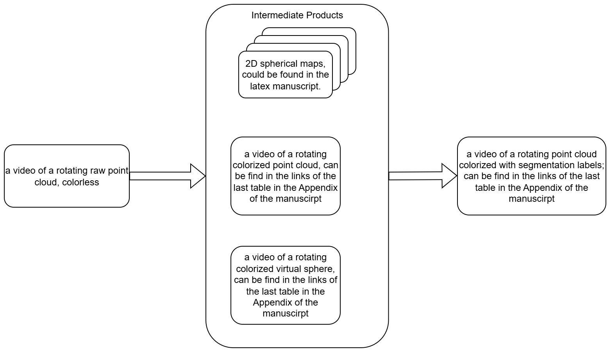

# Structure
Generally, our web page can multiple modules in the [reference web page: VGGT](https://vgg-t.github.io/), following the same order. 
- Title; authors; An animation panel (detailed below); links to paper and code showing as buttons; Abstract - one paragraph; Method-the pipeline figure in the paper along with it's caption; Qualitative visualization (detailed below); BibTeX; one line notice "This webpage template is adapted from Nerfies, under a CC BY-SA 4.0 License."
    - For the animation panel below the authors, use patterns below
        - 
    - For Quaitative Visualizations, use:
        - 

- If you have any suggestions, feel free to add one more page in the [draw.io project](https://app.diagrams.net/#G1frAHk5ogYeRZbYux3RabhOyAAK4O4-zF#%7B%22pageId%22%3A%226aUZKJHKyU2D8GGN8WgK%22%7D) that I created and let me know.

# Refs
- [Template-source-code](https://github.com/nerfies/nerfies.github.io)
- [reference web page: VGGT](https://vgg-t.github.io/)